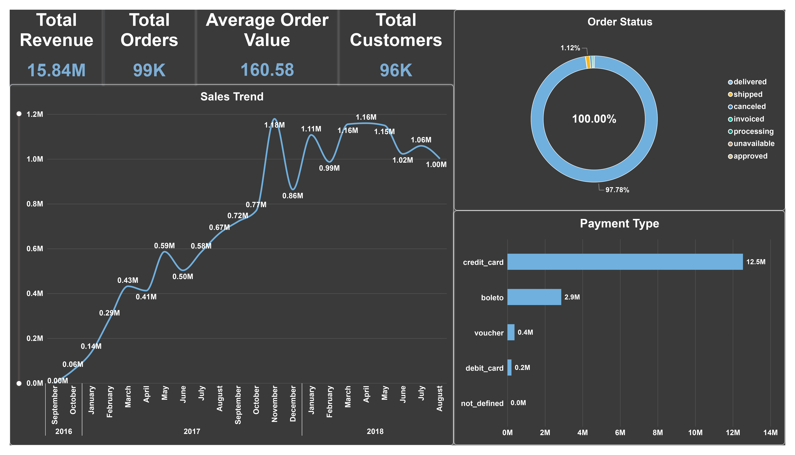
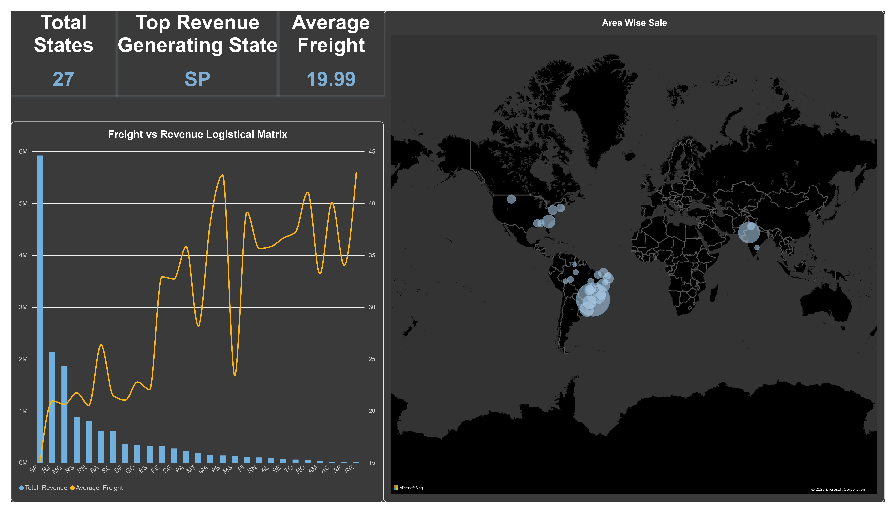
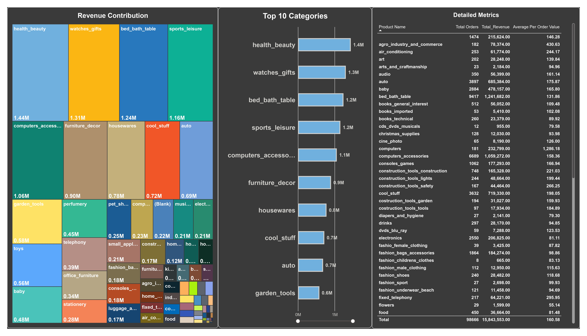
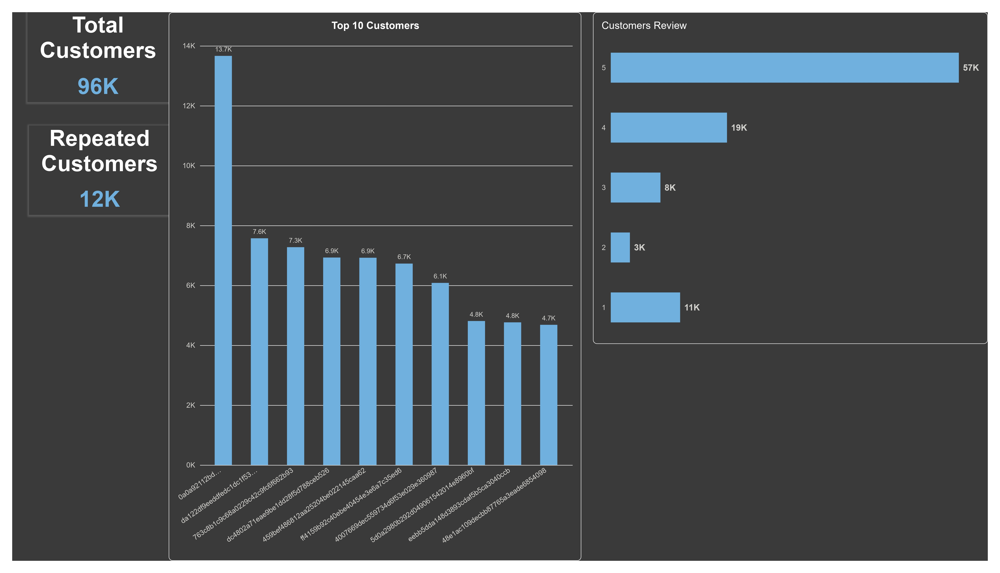
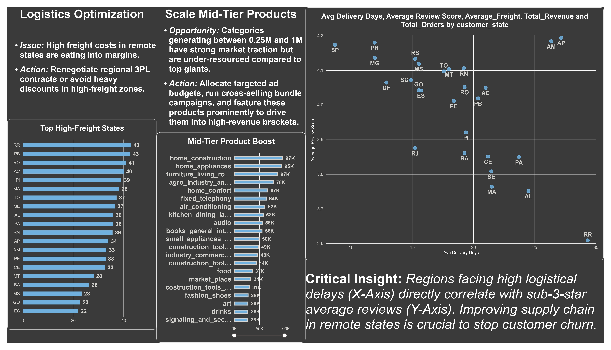

# Olist E-Commerce Data Analysis & Portfolio Project

## 📌 Project Overview
This project delivers an end-to-end data analytics solution using the Olist E-commerce dataset. The objective was to transition raw relational database tables into clean data, validate data integrity through rigorous SQL scripts, build a robust data model, and design an interactive Power BI dashboard to uncover crucial business insights regarding revenue generation, logistics, and customer satisfaction.

---

## 🛠️ Tools & Technologies Used
* **SQL (MySQL):** Used for data validation, missing value identification, duplicate tracking, and calculating foundational business KPIs.
* **Power BI & DAX:** Used for data modeling, creating advanced calculated columns and measures (such as delivery lead times and revenue calculations), and designing a 16:9 interactive dashboard.
* **Power Query (ETL):** Handled data transformation, cleaning anomalous unfulfilled orders, and preparing structured tables.

---

## 🔍 SQL Data Validation & Analysis Workflow
The underlying data pipeline and quality checks were executed using structured SQL queries (`Ecommerce Dashboard.sql`), focusing on:
1. **Null & Missing Value Checks:** Scanned core tables (`olist_customers_dataset`, `olist_order_items_dataset`, `olist_orders_dataset`, and `products`) for empty strings or null values to ensure structural integrity.
2. **Duplicate Identification:** Performed column-wise grouping and filtering (`HAVING COUNT(*) > 1`) on customer IDs, order IDs, and product entries to catch and analyze data redundancies.
3. **High-Level KPI Extraction:** Computed core business metrics directly from the database:
   * **Total Revenue:** Aggregated item prices combined with freight values (`price + freight_value`).
   * **Total Orders & Customers:** Distinct counts of orders and unique customer profiles.
   * **Average Order Value (AOV):** Calculated overall per-order pricing thresholds.

---

## 📊 Data Modeling & Visualization Highlights
* **Advanced Star-Schema Data Modeling:** Architected a robust relational data model joining multi-source Olist tables (customers, orders, order items, and products) to optimize filter propagation and enhance cross-filtering efficiency.
* **Core & Calculated DAX Measures:** Engineered robust calculated columns and advanced DAX aggregations—including complex time-to-delivery metrics (`Delivery_Days`), revenue realization formulas (`SUMX`, `RELATED`), and dynamic filtering measures—to accurately calculate core KPIs like Total Revenue, Order Volume, and Average Order Value (AOV).
* **Executive-Ready 16:9 Dashboard UI:** Designed a high-impact, custom-styled 16:9 interactive interface that transforms complex supply chain bottlenecks, revenue leakage, and customer satisfaction correlations into clear, actionable business insights.

---

## 📂 Repository Structure
```text
📦 Olist-ECommerce-Project/
│
├── 📄 Ecommerce Dashboard.pbix        # Power BI Master Model & Dashboard
├── 📄 Ecommerce Dashboard.pdf         # High-Resolution Portfolio Export Report
└── 📄 Ecommerce Dashboard.sql         # SQL Data Validation, Duplicates & KPI Scripts

### Dashboard Previews








